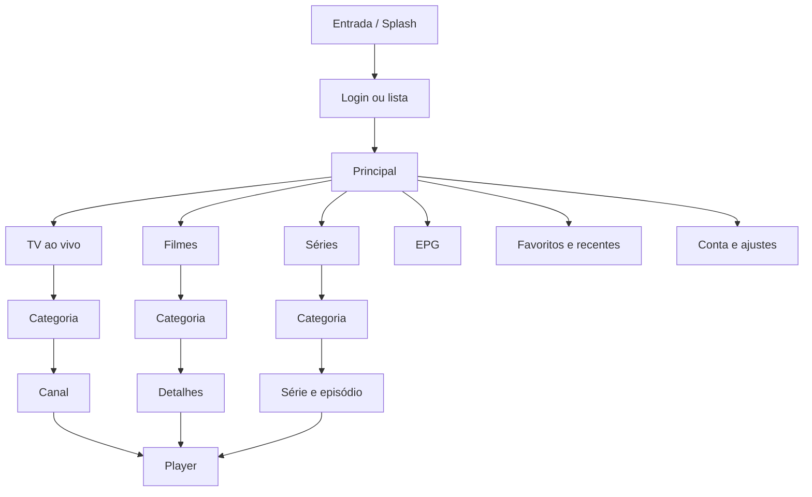

# Mapa de navegação (inferido estaticamente)

```mermaid
flowchart TD
 A[Entrada / Splash] --> B[Login ou lista]
 B --> C[Principal]
 C --> D[TV ao vivo]
 C --> E[Filmes]
 C --> F[Séries]
 C --> G[EPG]
 C --> H[Favoritos e recentes]
 C --> I[Conta e ajustes]
 D --> J[Categoria] --> K[Canal] --> L[Player]
 E --> M[Categoria] --> N[Detalhes] --> L
 F --> O[Categoria] --> P[Série e episódio] --> L
```

Atividades, tabelas e modelos sustentam os ramos; sequência, rótulos e acesso sem login não foram confirmados em runtime.
